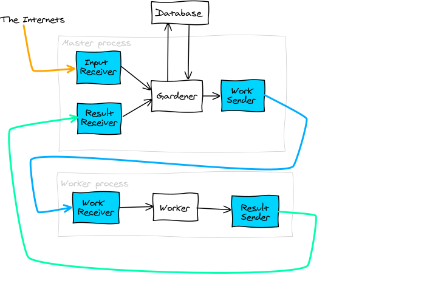

Garden
===============================================================================

Process
===============================================================================

When a garden is up and running, this is how the data flows:

As shown in the diagram above, there are three main kinds of data (represented 
by the three lines):

1. Input (new data)
2. Work
3. Results

For each kind of data, there are producers and consumers.  For instance, there 
are producers of Work (the Gardener) and consumers of Work (the Worker).

Indices and tables
==================

* :ref:`genindex`
* :ref:`modindex`
* :ref:`search`

